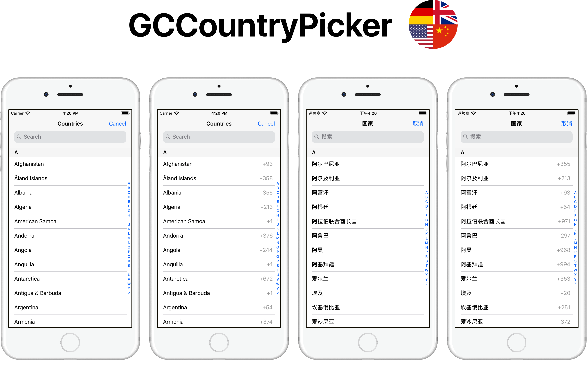

[](https://github.com/graycampbell/GCCountryPicker/releases/latest)
[](https://cocoapods.org/pods/GCCountryPicker)
[](https://graycampbell.github.io/GCCountryPicker)
[](https://www.codacy.com/app/graycampbell/GCCountryPicker?utm_source=github.com&amp;utm_medium=referral&amp;utm_content=graycampbell/GCCountryPicker&amp;utm_campaign=Badge_Grade)
[](https://developer.apple.com/swift)

[](https://github.com/graycampbell/GCCountryPicker/blob/master/LICENSE)

### CocoaPods

```
pod 'GCCountryPicker'
```

### Implementation

1. Add GCCountryPicker to your file's import statements.

    ```
    import GCCountryPicker
    ```

2. Create an instance of GCCountryPickerViewController.

    ```
    let countryPickerViewController = GCCountryPickerViewController(displayMode: .withoutCallingCodes)
    ```

3. Set the delegate, data source (optional), and navigation title.

    ```
    countryPickerViewController.delegate = self
    countryPickerViewController.dataSource = self
    countryPickerViewController.navigationItem.title = "Countries"
    ```

4. Embed the country picker view controller in a navigation controller.

    ```
    let navigationController = UINavigationController(rootViewController: countryPickerViewController)
    ```

5. Present the navigation controller.

    ```
    self.present(navigationController, animated: true, completion: nil)
    ```

6. Implement GCCountryPickerDelegate.

    ```
    func countryPickerDidCancel(_ countryPicker: GCCountryPickerViewController)
    
    func countryPicker(_ countryPicker: GCCountryPickerViewController, didSelectCountry country: GCCountry)
    ```

7. Implement GCCountryPickerDataSource if necessary.

    ```
    func countryCodes(for countryPicker: GCCountryPickerViewController) -> [String]
    ```

### Documentation

- [Classes](https://graycampbell.github.io/GCCountryPicker/Classes.html)
  - [GCCountry](https://graycampbell.github.io/GCCountryPicker/Classes/GCCountry.html)
  - [GCCountryPickerViewController](https://graycampbell.github.io/GCCountryPicker/Classes/GCCountryPickerViewController.html)
  
- [Enumerations](https://graycampbell.github.io/GCCountryPicker/Enums.html)
  - [GCCountryPickerDisplayMode](https://graycampbell.github.io/GCCountryPicker/Enums/GCCountryPickerDisplayMode.html)

- [Protocols](https://graycampbell.github.io/GCCountryPicker/Protocols.html)
  - [GCCountryPickerDelegate](https://graycampbell.github.io/GCCountryPicker/Protocols/GCCountryPickerDelegate.html)
  - [GCCountryPickerDataSource](https://graycampbell.github.io/GCCountryPicker/Protocols/GCCountryPickerDataSource.html)

### License

GCCountryPicker is available under the MIT license. See the [LICENSE](https://github.com/graycampbell/GCCountryPicker/blob/master/LICENSE) file for more info.
